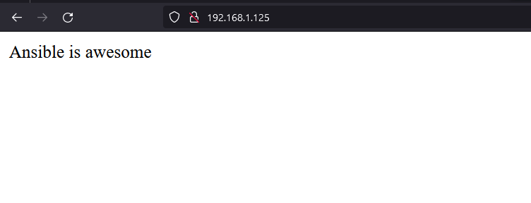

# ansible_training
Basic Ansible Learning Project

 **Cenario**
     

**source**
    

**Requirements**:

    - Vagrant
    - Virtualbox/VMware
    - WSL / Native Linux / Mac

1. First create the VM's
```console
cd /ubuntu
vagrant up
```

1. Create ssh-key to login on the target-machines
```console
ssh-keygen -t ed25519 -C "Ansible" -f ~/.ssh/ansible
```

1. Edit hosts file of the "ManagerHost" In my case WLS
```
# Ansible
192.168.1.123 node-3
192.168.1.122 node-2
192.168.1.121 node-1
```

1. Install ansible on Controler machine and add ssh on each of the machines
```console
apt install ansible -y &&
ssh-copy-id -i ~/.ssh/ansible.pub vagrant@node-1 &&
ssh-copy-id -i ~/.ssh/ansible.pub vagrant@node-2 &&
ssh-copy-id -i ~/.ssh/ansible.pub vagrant@node-3 &&
```

1. First ANSIBLE command
```console
ansible all --key-file ~/.ssh/ansible -i inventory -m ping -u vagrant
```

```json
node-3 | SUCCESS => {
    "ansible_facts": {
        "discovered_interpreter_python": "/usr/bin/python"
    },
    "changed": false,
    "ping": "pong"
}
node-2 | SUCCESS => {
    "ansible_facts": {
        "discovered_interpreter_python": "/usr/bin/python"
    },
    "changed": false,
    "ping": "pong"
}
node-1 | SUCCESS => {
    "ansible_facts": {
        "discovered_interpreter_python": "/usr/bin/python"
    },
    "changed": false,
    "ping": "pong"
}
```
6. Ansible gather_facts
```console
ansible all -m gather_facts --limit node-1
```
> This module is automatically called by playbooks to gather useful variables about remote hosts that can be used in playbooks.

7. ansible adhoc commands
> An Ansible ad hoc command uses the /usr/bin/ansible command-line tool to automate a single task on one or more managed nodes.
"Privilege permitions for exec commands on target machines.
Context: For the apt module we're using is possible to look at the official DOC for it
Here is the link: https://docs.ansible.com/ansible/2.9/modules/apt_module.html"

**NOK:**
```console
ansible all -m apt -a update_cache=true
```
```json
node-3 | FAILED! => {
    "ansible_facts": {
        "discovered_interpreter_python": "/usr/bin/python"
    },
    "changed": false,
    "msg": "Failed to lock apt for exclusive operation: Failed to lock /var/lib/apt/lists/lock"
}
node-1 | FAILED! => {
    "ansible_facts": {
        "discovered_interpreter_python": "/usr/bin/python"
    },
    "changed": false,
    "msg": "Failed to lock apt for exclusive operation: Failed to lock /var/lib/apt/lists/lock"
}
node-2 | FAILED! => {
    "ansible_facts": {
        "discovered_interpreter_python": "/usr/bin/python"
    },
    "changed": false,
    "msg": "Failed to lock apt for exclusive operation: Failed to lock /var/lib/apt/lists/lock"
```
>> To work we need to add --become and --ask-become-me-pass
```console
ansible all -m apt -a update_cache=true --become --ask-become-pass
```
```json
BECOME password:
 node-2 | CHANGED => {
    "ansible_facts": {
        "discovered_interpreter_python": "/usr/bin/python"
    },
    "cache_update_time": 1699108086,
    "cache_updated": true,
    "changed": true
}
node-1 | CHANGED => {
    "ansible_facts": {
        "discovered_interpreter_python": "/usr/bin/python"
    },
    "cache_update_time": 1699108087,
    "cache_updated": true,
    "changed": true
}
node-3 | CHANGED => {
    "ansible_facts": {
        "discovered_interpreter_python": "/usr/bin/python"
    },
    "cache_update_time": 1699108087,
    "cache_updated": true,
    "changed": true
}
```
> The command bellow we can install vim-nox editor, vagrant does not has sudo pass
> So you can use the command without --ask-become-pass.
```console
ansible all -m apt -a name=vim-nox --become
```

>> To upgrade the system 
```console
ansible all -m apt -a "upgrade=dist" --become
```

8. Playbooks
> A playbook is a multiple-machine deployment system, reusable and repeatable
```console
touch install_apache.yml
```
```yaml
---

- hosts: all        # Run in all Hosts on inventary
  become: true      # Run with sudo privileges
  tasks:            # The tasks to run 

  - name: Update Repository Index        # Simple indicative name
    apt:                                 # Module apt
      update_cache: yes                  # update index Cache

  - name: install apache2 package        # Indicative Name
    apt:                                 # Module APT
      name: apache2                      # The module to install
```
```console
ansible-playbook install_apache.yml

PLAY [all] ****************************************************************************************************************

TASK [Gathering Facts] ****************************************************************************************************
ok: [node-1]
ok: [node-3]
ok: [node-2]

TASK [install apache2 package] ********************************************************************************************
changed: [node-2]
changed: [node-3]
changed: [node-1]

PLAY RECAP ****************************************************************************************************************
node-1                     : ok=2    changed=1    unreachable=0    failed=0    skipped=0    rescued=0    ignored=0
node-2                     : ok=2    changed=1    unreachable=0    failed=0    skipped=0    rescued=0    ignored=0
node-3                     : ok=2    changed=1    unreachable=0    failed=0    skipped=0    rescued=0    ignored=0
```

### Hosts Groups
9.We can bind hosts by groups, like the example bellow:

```console
[web_servers]
node-1
node-2

[db_servers]
node-3
node-4

[file_servers]
node-5
node-6
```

10. Now is possible to group tasks 
```console
ansible db_servers -m ping
ansible web_servers -m ping
ansible file_servers -m ping
```
### Tags
11. Tags are metadata you canb attach to the tasks in an Ansible playbook
```yaml
  - name: Install MariDB package
    tags: mariadb,db,ubuntu
    apt: 
      name: mariadb-server
      state: latest
    when: ansible_distribution ==  'Ubuntu'
```
> How to list Tags available
```console
ansible-playbook --list-tags site.yml

playbook: site.yml

  play #1 (all): all    TAGS: []
      TASK TAGS: [always]

  play #2 (web_servers): web_servers    TAGS: []
      TASK TAGS: [apache, apache2, centos, httpd, ubuntu]

  play #3 (db_servers): db_servers      TAGS: []
      TASK TAGS: [centos, db, mariadb, ubuntu]

  play #4 (file_servers): file_servers  TAGS: []
      TASK TAGS: [samba]
```
> Now we'll target centos only
```console
ansible-playbook --tags centos site.yml 

PLAY [all] *******************************************************************************************************************************************************

TASK [Gathering Facts] *******************************************************************************************************************************************
ok: [node-4]
ok: [node-5]
ok: [node-3]
ok: [node-1]
ok: [node-2]
ok: [node-6]

TASK [Install Updates (CentOS)] **********************************************************************************************************************************
skipping: [node-1]
skipping: [node-2]
skipping: [node-3]
ok: [node-5]
ok: [node-4]
ok: [node-6]

TASK [Install Update (Ubuntu)] ***********************************************************************************************************************************
skipping: [node-5]
skipping: [node-4]
skipping: [node-6]
ok: [node-3]
ok: [node-1]
ok: [node-2]

PLAY [web_servers] ***********************************************************************************************************************************************

TASK [Gathering Facts] *******************************************************************************************************************************************
ok: [node-5]
ok: [node-2]
ok: [node-1]

TASK [update and install httpd, php package for CentOS] **********************************************************************************************************
skipping: [node-1]
skipping: [node-2]
ok: [node-5]

PLAY [db_servers] ************************************************************************************************************************************************

TASK [Gathering Facts] *******************************************************************************************************************************************
ok: [node-4]
ok: [node-3]

TASK [Install MariDB package] ************************************************************************************************************************************
skipping: [node-3]
ok: [node-4]

PLAY [file_servers] **********************************************************************************************************************************************

TASK [Gathering Facts] *******************************************************************************************************************************************
ok: [node-6]

PLAY RECAP *******************************************************************************************************************************************************
node-1                     : ok=3    changed=0    unreachable=0    failed=0    skipped=2    rescued=0    ignored=0   
node-2                     : ok=3    changed=0    unreachable=0    failed=0    skipped=2    rescued=0    ignored=0   
node-3                     : ok=3    changed=0    unreachable=0    failed=0    skipped=2    rescued=0    ignored=0   
node-4                     : ok=4    changed=0    unreachable=0    failed=0    skipped=1    rescued=0    ignored=0   
node-5                     : ok=4    changed=0    unreachable=0    failed=0    skipped=1    rescued=0    ignored=0   
node-6                     : ok=3    changed=0    unreachable=0    failed=0    skipped=1    rescued=0    ignored=0 
```
>> You can run tasks plays on specifics tags listed on the first command.
>> If you want to use multiple tags make sure to use double quotes: "samba,db,httpd"

### Ansible Copy module 
12. You can use copy module to transfer files to target machines.
```yaml
  - name: Copy Default html file for site
    tags: httpd, centos, apache
    copy:
      src: default_site.html
      dest: /var/www/html/index.html
      owner: root
      group: root
      mode: 0644
```
```console
ansible-playboot site.yml
```
> At the example before the task will send the default_site.html to all webservers:


### Using service Module to start service
13. Is possible to use "service" module to modify status of any service
> Below we use httpd service as example
```yaml
  - name: Start httpd (CENTOS)
    tags: httpd, centos, apache
    service:
      name: httpd
      state: started
      enabled: yes   # This the option to enable service on reboot.
    when: ansible_distribution == 'CentOS'
```
```console
TASK [Start httpd (CENTOS)] **************************************************************************************************************************************
skipping: [node-1]
skipping: [node-2]
changed: [node-5]
PLAY RECAP *******************************************************************************************************************************************************
node-1                     : ok=5    changed=0    unreachable=0    failed=0    skipped=3    rescued=0    ignored=0   
node-2                     : ok=5    changed=0    unreachable=0    failed=0    skipped=3    rescued=0    ignored=0   
node-3                     : ok=4    changed=0    unreachable=0    failed=0    skipped=2    rescued=0    ignored=0   
node-4                     : ok=4    changed=0    unreachable=0    failed=0    skipped=2    rescued=0    ignored=0   
node-5                     : ok=6    changed=1    unreachable=0    failed=0    skipped=2    rescued=0    ignored=0   
node-6                     : ok=4    changed=0    unreachable=0    failed=0    skipped=1    rescued=0    ignored=0
```
> Note: use "enable: yes" to ensure the service starts on reboot

### lineinfile and service module
14. On the example below we can use the restart state of service module to restart the httpd service together with lineinfile module.
```yaml
  - name: Change Email Addres for admin
    tags: apache, centos, httpd
    lineinfile:
      path: /etc/httpd/conf/httpd.conf
      regexp: '^ServerAdmin'
      line: ServerAdmin test@gmail.com'
    when: ansible_distribution == 'CentOS'
    register: httpd     # Simple stores a variable to use in the next task

  - name: restart httpd (CENTOS)
    tags: apache, centos, httpd
    service:
      name: httpd
      state: restarted
    when: httpd.changed  # VAriable from register httpd
```
```console
TASK [Change Email Addres for admin] *****************************************************************************************************************************
skipping: [node-1]
skipping: [node-2]
changed: [node-5]

TASK [restart httpd (CENTOS)] ************************************************************************************************************************************
skipping: [node-1]
skipping: [node-2]
changed: [node-5]

PLAY RECAP *******************************************************************************************************************************************************
node-1                     : ok=5    changed=0    unreachable=0    failed=0    skipped=5    rescued=0    ignored=0   
node-2                     : ok=5    changed=0    unreachable=0    failed=0    skipped=5    rescued=0    ignored=0   
node-3                     : ok=4    changed=0    unreachable=0    failed=0    skipped=2    rescued=0    ignored=0   
node-4                     : ok=4    changed=0    unreachable=0    failed=0    skipped=2    rescued=0    ignored=0   
node-5                     : ok=8    changed=2    unreachable=0    failed=0    skipped=2    rescued=0    ignored=0   
node-6                     : ok=4    changed=0    unreachable=0    failed=0    skipped=1    rescued=0    ignored=0 
```
> First we change a line on httpd.conf file the confirm that with register and restarted service on next task.